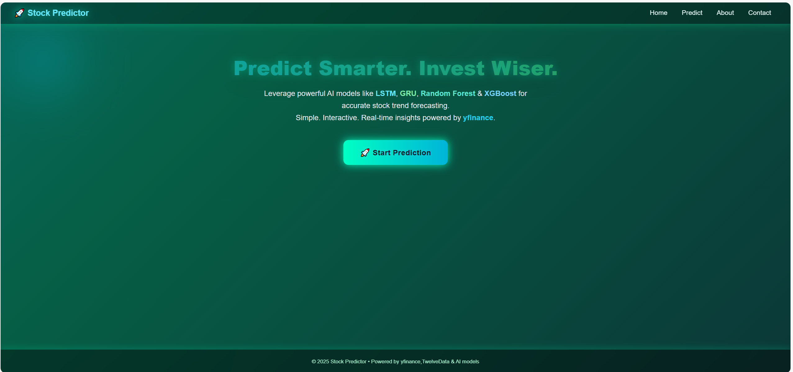
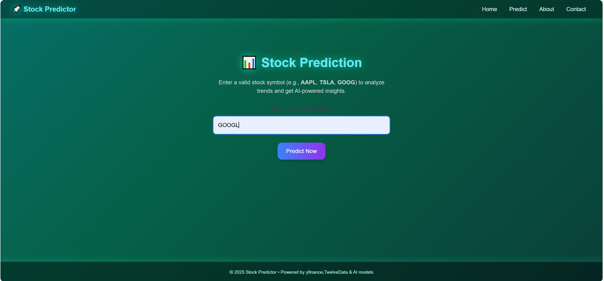
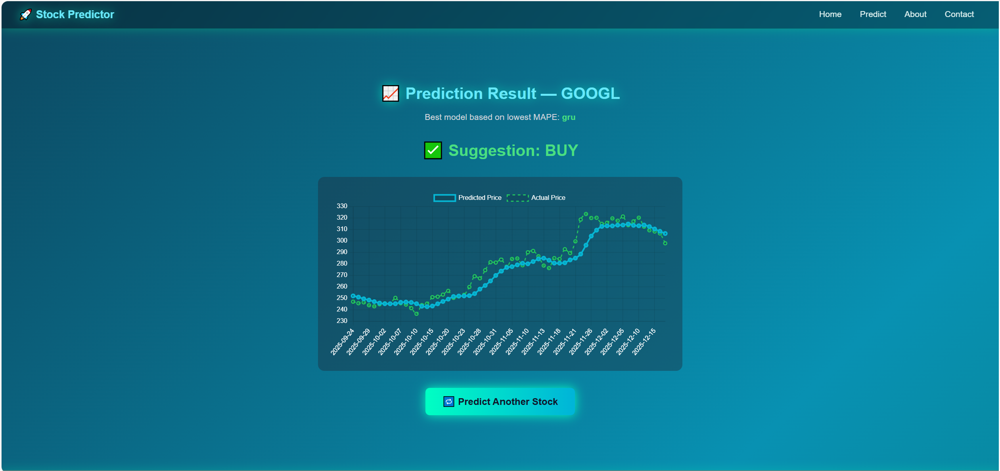
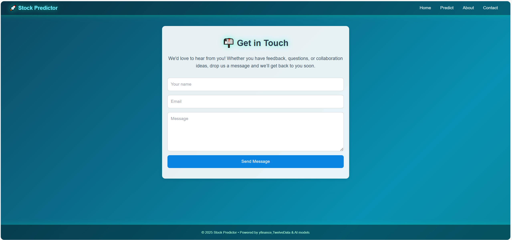

📈 Stock Price Prediction Web Application

A web-based stock price prediction system developed using machine learning and deep learning models.
The application fetches real-time historical stock data, predicts future prices, evaluates model accuracy, and provides Buy/Sell/Avoid suggestions for learning and academic purposes.

---

## 🚀 Features

Real-time stock data fetching from Yahoo Finance

Multiple prediction models for comparison

Automatic best model selection using error metrics

Buy / Sell / Avoid recommendation system

REST API support for predictions

Simple and user-friendly web interface

---

## 🛠️ Tech Stack

### Backend
- Python
- Flask
- TensorFlow / Keras
- Scikit-learn
- yfinance
- Pandas, NumPy

### Frontend
- HTML5
- CSS3
- JavaScript
- Chart.js

---

## 📂 Project Structure

stock-price-predictor/
│
├── app.py
├── train_models.py
├── requirements.txt
│── screenshots
│ ├── home_page.png
│ ├── predict_page.png
│ ├── result_page.png
│ ├── about_page.png
│ ├── contact_page.png
├── models/
│ ├── lstm.h5
│ ├── gru.h5
│ ├── xgb.pkl
│ └── svr.pkl
│
├── templates/
│ ├── base.html
│ ├── index.html
│ ├── prediction.html
│ ├── result.html
│ ├── models.html
│ ├── about.html
│ └── contact.html
│
├── static/
│ ├── css/
│ │ └── style.css
│ └── js/
│ └── result_chart.js
│
└── README.md

yaml

## 📸 Output / Results

### Prediction Result Page
Below screenshot shows the final stock price prediction result with model comparison and suggestion (BUY / SELL / AVOID).
**Home page**

**Prediction page**

**Result page**

**About page**

**Contact page**

## ⚙️ Installation & Setup

1️⃣ Clone the repository

git clone https://github.com/your-username/stock-price-predictor.git
cd stock-price-predictor

2️⃣ Install dependencies

pip install -r requirements.txt

3️⃣ Run the application

python app.py

4️⃣ Open in browser

http://127.0.0.1:5000

🔮** How Prediction Works**

User enters a stock symbol (AAPL, TSLA, RELIANCE, TCS, etc.)

Real-time historical data is fetched from Yahoo Finance

Data preprocessing & scaling is applied

Each model predicts future prices

MAPE (Mean Absolute Percentage Error) is calculated

Best model is selected automatically

Final prediction & suggestion is displayed

📊 Suggestion Logic

Condition	Suggestion
Price ↑ and Confidence > 50%	Buy
Price ↓ and Confidence > 50%	Sell
Small change / Low confidence	Avoid

📌** Future Enhancements**

Live auto-refresh every 60 seconds

Candlestick charts

News sentiment analysis

User authentication & portfolio tracking

Deployment on cloud (AWS / Render)

📜** Disclaimer**
This project is built for academic and learning purposes only.
Do not use it for real financial trading decisions.

